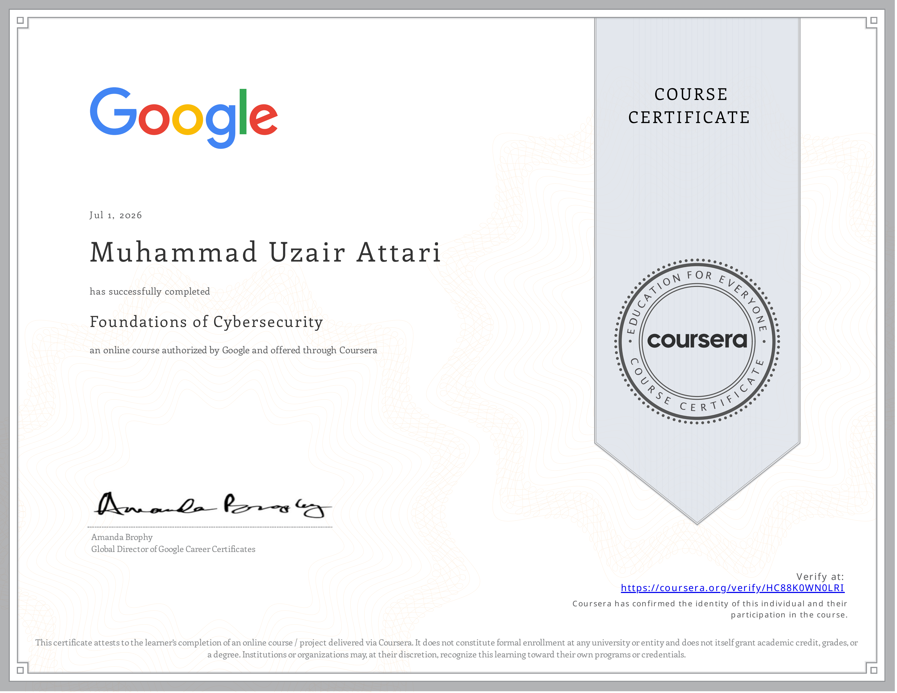

# 📘 Course 1 — Foundations of Cybersecurity

> Personal notes, interview refreshers, key concepts, and reflections from **Course 1** of the Google Cybersecurity Professional Certificate.

---

### What This Course Covers

An entry-level overview of the cybersecurity landscape — who security analysts are,
what they do, and the foundational concepts that underpin the entire field.

### Key Concepts Learned

**🔐 The CIA Triad**
The three core principles every security decision is measured against:

- **Confidentiality** — only authorized people access the data
- **Integrity** — data is accurate and untampered
- **Availability** — systems and data are accessible when needed

**🏛️ The 8 CISSP Security Domains**
The eight domains that define the scope of cybersecurity work:
`Security & Risk Management` · `Asset Security` · `Security Architecture` ·
`Communication & Network Security` · `Identity & Access Management` ·
`Security Assessment & Testing` · `Security Operations` · `Software Development Security`

**⚔️ A Brief History of Cyber Attacks**

- Early attacks were curiosity-driven (Morris Worm, 1988)
- Evolved into financially and politically motivated threats
- Today's landscape: ransomware, state-sponsored attacks, social engineering at scale

**🧰 Core Toolkit of an Entry-Level Analyst**

- SIEM tools (Security Information and Event Management)
- Network protocol analyzers (e.g. Wireshark)
- Playbooks — step-by-step incident response guides

**📋 Security Frameworks & Controls**

- **NIST Cybersecurity Framework** — identify, protect, detect, respond, recover
- Controls exist at three levels: physical, technical, and administrative

### Honest Reflection

> This course is explicitly designed for people with zero IT background.
> My software engineering foundation meant I moved through it faster than the recommended pace —
> concepts like networking, OS structure, and programming references landed immediately.
> That said, I didn't skip it. Fundamentals explained clearly are worth revisiting,
> especially when you're about to teach them to someone else.

### Certificate

---

# ⏭️ Next Course

➡️ **Course 2 — Play It Safe: Manage Security Risks**

Topics include:

- Risk Management
- NIST RMF
- SIEM
- SOC Analyst Workflow
- Security Playbooks

---

**Part of my Google Cybersecurity Professional Certificate Journey**

⬅️ [Back to Main Repository](../README.md) ㅤ | ㅤ [Next Course](02_PLAY-IT-SAFE/README.md) ➡️

