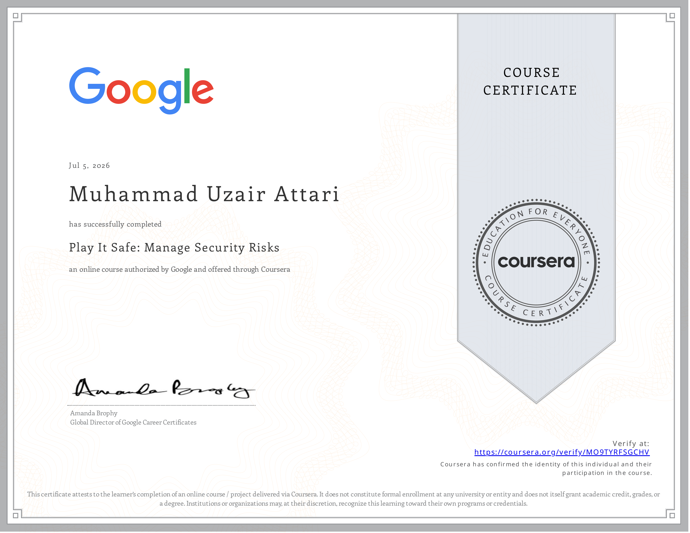

# 📘 Course 2 — Play It Safe: Manage Security Risks

> Personal notes, interview refreshers, key concepts, and reflections from **Course 2** of the Google Cybersecurity Professional Certificate.

---

### What This Course Covers

A deeper look at how security professionals think about and manage risk — the frameworks
they follow, the tools they use, and what the day-to-day reality of a SOC analyst
actually looks like.

### Key Concepts Learned

**🏗️ Security Frameworks**

- **CISSP's 8 Security Domains** revisited in depth — understanding how risk maps across each domain
- **NIST Cybersecurity Framework (CSF)** — the industry standard for managing and reducing cybersecurity risk: Identify → Protect → Detect → Respond → Recover
- **NIST RMF (Risk Management Framework)** — the 7-step process organizations use to manage security risk formally

**📊 SIEM Tools**

- What Security Information and Event Management tools do — aggregate and analyze log data from across an organization in real time
- How analysts use SIEM dashboards to detect threats, monitor activity, and investigate incidents
- Introduction to tools like Splunk and Chronicle

**📋 Playbooks**

- What playbooks are — step-by-step guides analysts follow during specific incident types
- Why consistency matters in incident response — human error under pressure is a real threat
- How playbooks connect to the broader incident response lifecycle

**👤 Life of a SOC Analyst**

- What entry-level analysts actually do day-to-day — triaging alerts, investigating events, escalating incidents, documenting findings
- The tools, communication protocols, and decision frameworks they rely on
- Insights from Google security professionals — real stories, early mistakes, and what they wish they knew

### Honest Reflection

> Course 1 was familiar territory. Course 2 was the first time I felt genuinely challenged —
> not technically, but in how I think. Security at this level is less about code and more
> about judgment: what matters, what doesn't, and what you do when you're not sure.
> Hearing directly from people working security at Google made the career path feel real
> in a way that a textbook never could.

### Certificate

---

# ⏭️ Next Course

➡️ **Course 3 — Connect and Protect: Networks and Network Security**

Topics include:

- Network Architecture
- TCP/IP & OSI Models
- Network Protocols
- Firewalls & VPNs
- Packet Analysis
- Network Security
- Security Hardening

---

**Part of my Google Cybersecurity Professional Certificate Journey**

⬅️ [Back to Main Repository](../README.md)&ensp  |   &ensp[Next Course](03_CONNECT-AND-PROTECT/README.md) ➡️

